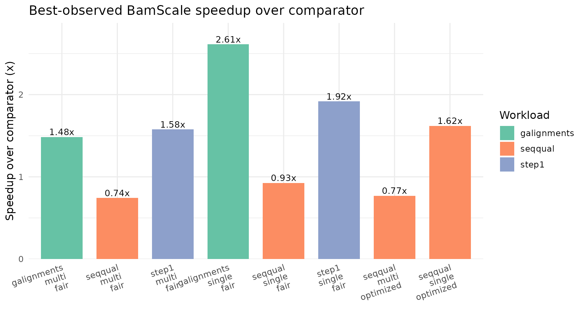
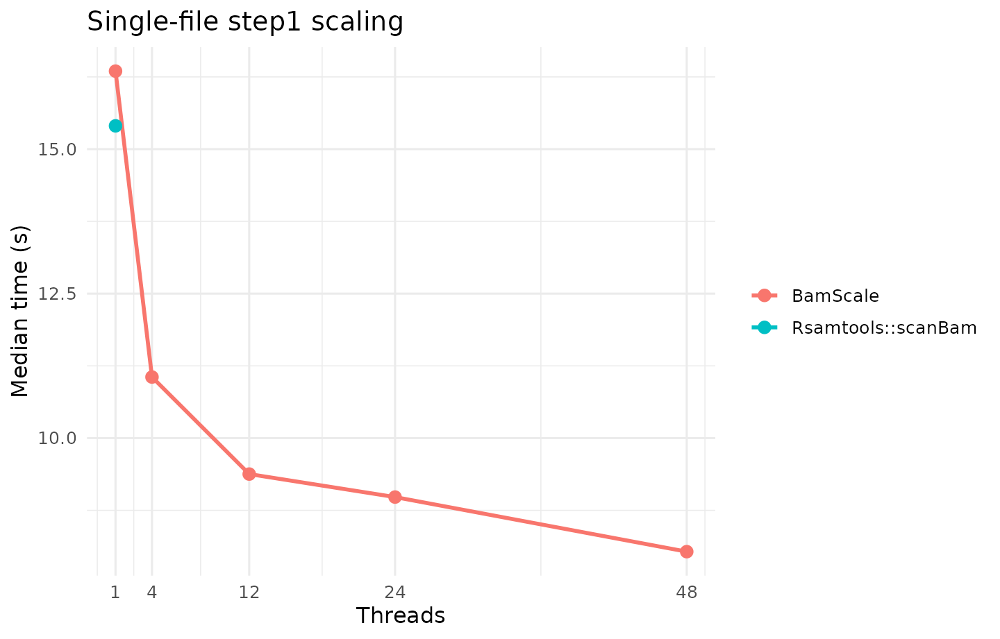
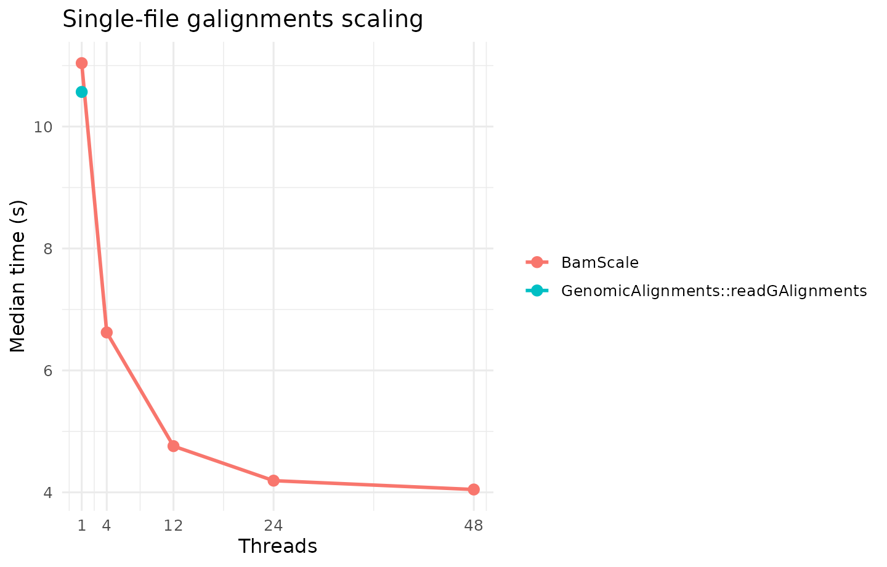
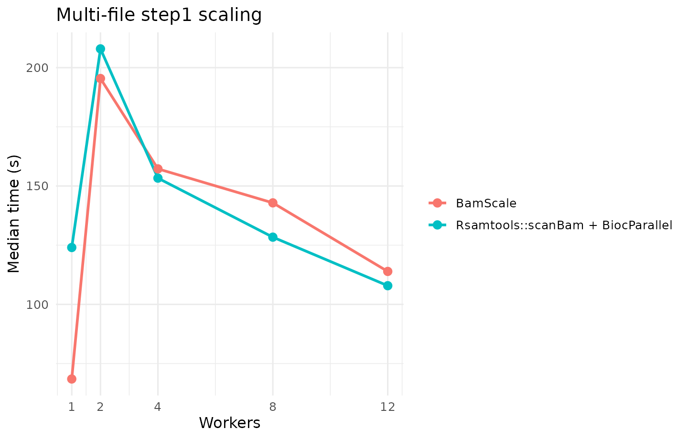
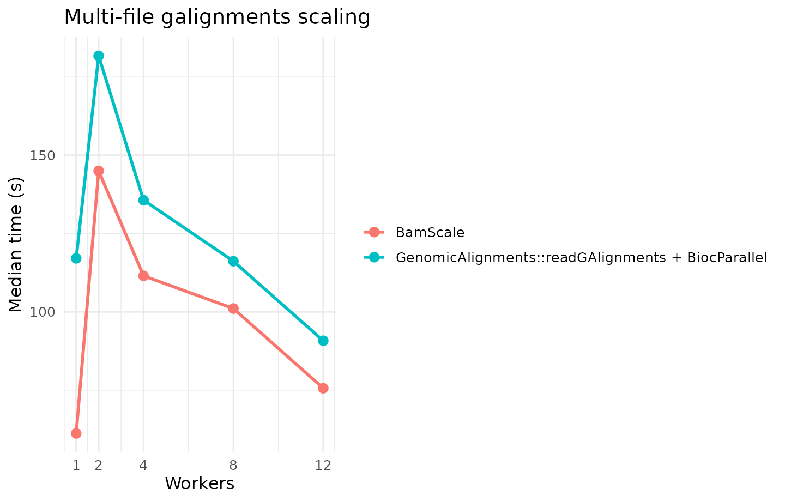
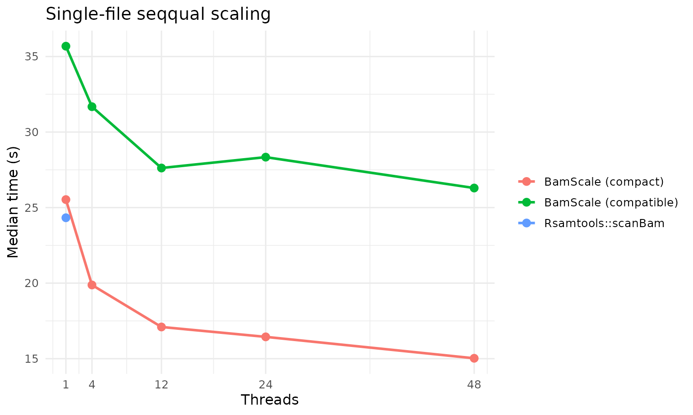
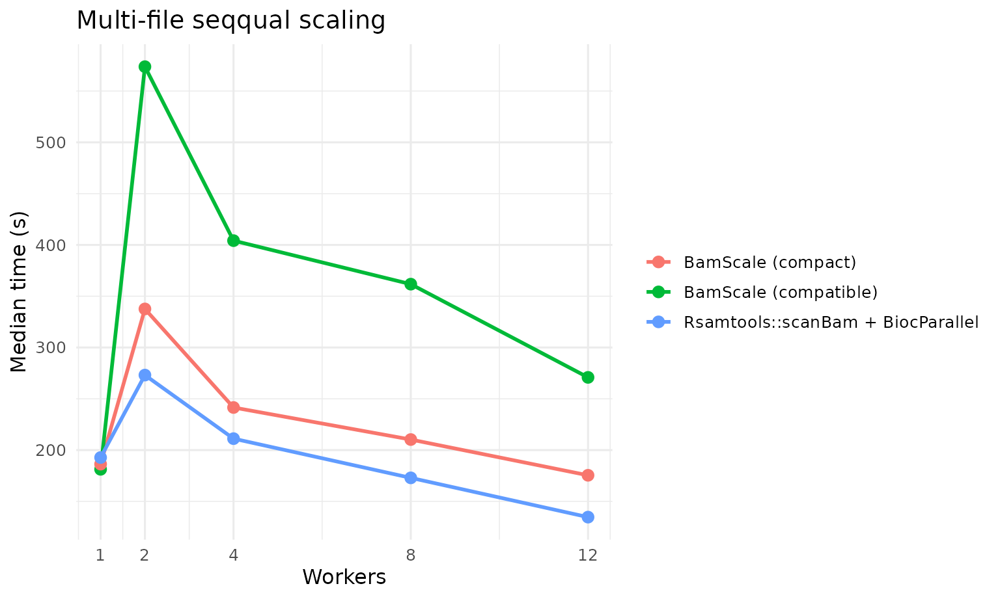
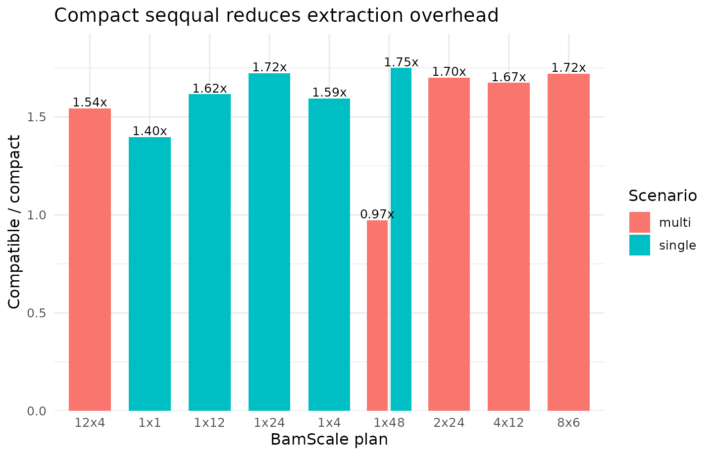

# Benchmarking BamScale Across Step1, GAlignments, and SeqQual Workloads

## Overview

This article combines the final benchmark runs used for the current
BamScale benchmark summary:

- `step1` and `galignments` from run_20260320_133141
- `seqqual` from run_20260320_162359

These runs were generated with the same server-first benchmark harness,
the same balanced profile family, the same deterministic case order, and
the same worker/thread budget policy. `Seqqual` is reported separately
because it includes both the fair compatibility track and the optimized
compact track.

## Data Loading

## Benchmark Provenance

- Step1 and GAlignments run: run_20260320_133141
- SeqQual run: run_20260320_162359
- Step1/GAlignments results directory:
  /home/runner/work/BamScale/BamScale/inst/benchmarks/run_20260320_133141
- SeqQual results directory:
  /home/runner/work/BamScale/BamScale/inst/benchmarks/run_20260320_162359

| Run | Workloads | Profile | CPU | Logical cores | RAM (GB) | Successful cases |
|:---|:---|:---|:---|---:|---:|---:|
| run_20260320_133141 | step1, galignments | balanced | Intel(R) Xeon(R) Gold 6252 CPU @ 2.10GHz | 96 | 723.6 | 32 |
| run_20260320_162359 | seqqual | balanced | Intel(R) Xeon(R) Gold 6252 CPU @ 2.10GHz | 96 | 723.6 | 26 |

## Methods Rationale

This benchmark suite covers three distinct access patterns:

- `step1`: alignment-metadata extraction without sequence/quality
  materialization. This is a good proxy for BAM filtering,
  fragment-length profiling, and fragment-distribution QC.
- `galignments`: construction of alignment objects suitable for
  Bioconductor workflows centered on `GenomicAlignments`.
- `seqqual`: full sequence and quality extraction. This is reported in
  two BamScale modes:
  - `fair` compatibility mode, which is the closest comparator to
    [`Rsamtools::scanBam`](https://rdrr.io/pkg/Rsamtools/man/scanBam.html)
  - `optimized` compact mode, which reduces internal overhead and should
    be interpreted as an optimized BamScale track rather than a strict
    apples-to-apples replacement for the compatibility path

Across all runs, the benchmark design emphasizes:

- deterministic case order
- balanced BamScale worker/thread plans
- explicit comparator baselines
- single-file and multi-file reporting
- fixed 48-thread budget for multi-file plans

## Input Files

The same underlying four selected BAMs were used for both runs, with
repeated files allowed to populate the 12-file multi-file benchmark set.

| file | source | selected_for_single | selected_for_multi | size_mb | has_index |
|:---|:---|:---|:---|---:|:---|
| /home/chiragp/.cache/R/ExperimentHub/134ab745547e62_2073 | chipseqDBData | TRUE | TRUE | 548.3 | TRUE |
| /home/chiragp/.cache/R/ExperimentHub/134ab7270c5da5_2072 | chipseqDBData | FALSE | TRUE | 320.4 | TRUE |
| /home/chiragp/.cache/R/ExperimentHub/134ab721bfa655_2071 | chipseqDBData | FALSE | TRUE | 305.2 | TRUE |
| /home/chiragp/.cache/R/ExperimentHub/134ab7231ef47d_2074 | chipseqDBData | FALSE | TRUE | 227.3 | TRUE |

## Reference Counts

| run                 | scenario | workload    | n_files | n_records | total_mb |
|:--------------------|:---------|:------------|--------:|----------:|---------:|
| run_20260320_133141 | multi    | galignments |      12 |  77543925 |   4203.4 |
| run_20260320_133141 | multi    | step1       |      12 | 132482148 |   4203.4 |
| run_20260320_133141 | single   | galignments |       1 |   4670364 |    548.3 |
| run_20260320_133141 | single   | step1       |       1 |  16675372 |    548.3 |
| run_20260320_162359 | multi    | seqqual     |      12 | 132482148 |   4203.4 |
| run_20260320_162359 | single   | seqqual     |       1 |  16675372 |    548.3 |

## Best-Observed Summary

| Scenario | Workload | Track | Method family | Method | Plan | Median time (s) |
|:---|:---|:---|:---|:---|:---|---:|
| multi | galignments | fair | BamScale | BamScale (balanced budget) | 1x48 | 61.204 |
| multi | galignments | fair | GenomicAlignments | GenomicAlignments::readGAlignments + BiocParallel | 12x1 | 90.777 |
| multi | seqqual | fair | BamScale | BamScale (balanced budget) | 1x48 | 181.277 |
| multi | seqqual | fair | Rsamtools | Rsamtools::scanBam + BiocParallel | 12x1 | 134.667 |
| multi | seqqual | optimized | BamScale | BamScale (compact seqqual budget) | 12x4 | 175.451 |
| multi | step1 | fair | BamScale | BamScale (balanced budget) | 1x48 | 68.469 |
| multi | step1 | fair | Rsamtools | Rsamtools::scanBam + BiocParallel | 12x1 | 107.882 |
| single | galignments | fair | BamScale | BamScale | 1x48 | 4.047 |
| single | galignments | fair | GenomicAlignments | GenomicAlignments::readGAlignments | 1x1 | 10.568 |
| single | seqqual | fair | BamScale | BamScale | 1x48 | 26.295 |
| single | seqqual | fair | Rsamtools | Rsamtools::scanBam | 1x1 | 24.327 |
| single | seqqual | optimized | BamScale | BamScale (compact seqqual) | 1x48 | 15.026 |
| single | step1 | fair | BamScale | BamScale | 1x48 | 8.035 |
| single | step1 | fair | Rsamtools | Rsamtools::scanBam | 1x1 | 15.403 |

## BamScale-versus-Comparator Fold Change

| Scenario | Workload | Track | Comparator family | Comparator method | Comparator plan | Comparator time (s) | BamScale method | BamScale plan | BamScale time (s) | Comparator/BamScale | BamScale % faster |
|:---|:---|:---|:---|:---|:---|---:|:---|:---|---:|---:|---:|
| single | galignments | fair | GenomicAlignments | GenomicAlignments::readGAlignments | 1x1 | 10.568 | BamScale | 1x48 | 4.047 | 2.611 | 61.705 |
| single | step1 | fair | Rsamtools | Rsamtools::scanBam | 1x1 | 15.403 | BamScale | 1x48 | 8.035 | 1.917 | 47.835 |
| multi | galignments | fair | GenomicAlignments | GenomicAlignments::readGAlignments + BiocParallel | 12x1 | 90.777 | BamScale (balanced budget) | 1x48 | 61.204 | 1.483 | 32.578 |
| multi | step1 | fair | Rsamtools | Rsamtools::scanBam + BiocParallel | 12x1 | 107.882 | BamScale (balanced budget) | 1x48 | 68.469 | 1.576 | 36.534 |
| single | seqqual | fair | Rsamtools | Rsamtools::scanBam | 1x1 | 24.327 | BamScale | 1x48 | 26.295 | 0.925 | -8.088 |
| single | seqqual | optimized | Rsamtools | Rsamtools::scanBam | 1x1 | 24.327 | BamScale (compact seqqual) | 1x48 | 15.026 | 1.619 | 38.232 |
| multi | seqqual | fair | Rsamtools | Rsamtools::scanBam + BiocParallel | 12x1 | 134.667 | BamScale (balanced budget) | 1x48 | 181.277 | 0.743 | -34.611 |
| multi | seqqual | optimized | Rsamtools | Rsamtools::scanBam + BiocParallel | 12x1 | 134.667 | BamScale (compact seqqual budget) | 12x4 | 175.451 | 0.768 | -30.285 |

## Single-File `step1`

| Method family | Method             | Plan | Median time (s) |
|:--------------|:-------------------|:-----|----------------:|
| BamScale      | BamScale           | 1x48 |          8.0350 |
| BamScale      | BamScale           | 1x24 |          8.9795 |
| BamScale      | BamScale           | 1x12 |          9.3775 |
| BamScale      | BamScale           | 1x4  |         11.0565 |
| Rsamtools     | Rsamtools::scanBam | 1x1  |         15.4030 |
| BamScale      | BamScale           | 1x1  |         16.3500 |

## Single-File `galignments`

| Method family     | Method                             | Plan | Median time (s) |
|:------------------|:-----------------------------------|:-----|----------------:|
| BamScale          | BamScale                           | 1x48 |          4.0470 |
| BamScale          | BamScale                           | 1x24 |          4.1920 |
| BamScale          | BamScale                           | 1x12 |          4.7585 |
| BamScale          | BamScale                           | 1x4  |          6.6230 |
| GenomicAlignments | GenomicAlignments::readGAlignments | 1x1  |         10.5680 |
| BamScale          | BamScale                           | 1x1  |         11.0405 |

## Multi-File `step1`

## Multi-File `galignments`

## Single-File `seqqual`

| Method                | Plan | Median time (s) |
|:----------------------|:-----|----------------:|
| BamScale (compact)    | 1x48 |         15.0265 |
| BamScale (compact)    | 1x24 |         16.4440 |
| BamScale (compact)    | 1x12 |         17.0985 |
| BamScale (compact)    | 1x4  |         19.8780 |
| Rsamtools::scanBam    | 1x1  |         24.3275 |
| BamScale (compact)    | 1x1  |         25.5300 |
| BamScale (compatible) | 1x48 |         26.2950 |
| BamScale (compatible) | 1x12 |         27.6200 |
| BamScale (compatible) | 1x24 |         28.3390 |
| BamScale (compatible) | 1x4  |         31.6780 |
| BamScale (compatible) | 1x1  |         35.6830 |

## Multi-File `seqqual`

## Compact-versus-Compatible `seqqual`

| Scenario | Workload | Plan | Compatible time (s) | Compact time (s) | Compatible/Compact |
|:---|:---|:---|---:|---:|---:|
| multi | seqqual | 1x48 | 181.277 | 186.321 | 0.973 |
| multi | seqqual | 2x24 | 573.752 | 337.596 | 1.700 |
| multi | seqqual | 4x12 | 404.183 | 241.524 | 1.673 |
| multi | seqqual | 8x6 | 361.750 | 210.290 | 1.720 |
| multi | seqqual | 12x4 | 270.889 | 175.451 | 1.544 |
| single | seqqual | 1x1 | 35.683 | 25.530 | 1.398 |
| single | seqqual | 1x4 | 31.678 | 19.878 | 1.594 |
| single | seqqual | 1x12 | 27.620 | 17.098 | 1.615 |
| single | seqqual | 1x24 | 28.339 | 16.444 | 1.723 |
| single | seqqual | 1x48 | 26.295 | 15.026 | 1.750 |

## Interpretation

The benchmark shows a consistent pattern across the final runs:

- `step1` and `galignments` are the strongest BamScale workloads.
- For these workloads, the best BamScale plans are usually low-worker,
  high-thread configurations, indicating that within-file multithreading
  contributes more than aggressively increasing the number of file
  workers.
- `Seqqual` is more difficult because sequence and quality extraction
  amplifies output-construction overhead.
- BamScale compact mode narrows this gap substantially and produces the
  strongest single-file `seqqual` result, but the best multi-file
  `seqqual` comparator remains faster.

In practical terms, these results support the following guidance:

- use BamScale when metadata extraction or alignment-object construction
  is a bottleneck in BAM-heavy Bioconductor workflows
- favor low-worker, high-thread plans when traversing one or a small
  number of large BAM files
- interpret compact `seqqual` as an optimized throughput path rather
  than as a strict compatibility benchmark

## Session Information

    ## R version 4.6.0 (2026-04-24)
    ## Platform: x86_64-pc-linux-gnu
    ## Running under: Ubuntu 24.04.4 LTS
    ## 
    ## Matrix products: default
    ## BLAS:   /usr/lib/x86_64-linux-gnu/openblas-pthread/libblas.so.3 
    ## LAPACK: /usr/lib/x86_64-linux-gnu/openblas-pthread/libopenblasp-r0.3.26.so;  LAPACK version 3.12.0
    ## 
    ## locale:
    ##  [1] LC_CTYPE=C.UTF-8       LC_NUMERIC=C           LC_TIME=C.UTF-8       
    ##  [4] LC_COLLATE=C.UTF-8     LC_MONETARY=C.UTF-8    LC_MESSAGES=C.UTF-8   
    ##  [7] LC_PAPER=C.UTF-8       LC_NAME=C              LC_ADDRESS=C          
    ## [10] LC_TELEPHONE=C         LC_MEASUREMENT=C.UTF-8 LC_IDENTIFICATION=C   
    ## 
    ## time zone: UTC
    ## tzcode source: system (glibc)
    ## 
    ## attached base packages:
    ## [1] stats     graphics  grDevices utils     datasets  methods   base     
    ## 
    ## other attached packages:
    ## [1] scales_1.4.0     ggplot2_4.0.3    tidyr_1.3.2      dplyr_1.2.1     
    ## [5] readr_2.2.0      BiocStyle_2.40.0
    ## 
    ## loaded via a namespace (and not attached):
    ##  [1] bit_4.6.0           gtable_0.3.6        jsonlite_2.0.0     
    ##  [4] crayon_1.5.3        compiler_4.6.0      BiocManager_1.30.27
    ##  [7] tidyselect_1.2.1    parallel_4.6.0      jquerylib_0.1.4    
    ## [10] systemfonts_1.3.2   textshaping_1.0.5   yaml_2.3.12        
    ## [13] fastmap_1.2.0       R6_2.6.1            labeling_0.4.3     
    ## [16] generics_0.1.4      knitr_1.51          tibble_3.3.1       
    ## [19] bookdown_0.46       desc_1.4.3          RColorBrewer_1.1-3 
    ## [22] bslib_0.10.0        pillar_1.11.1       tzdb_0.5.0         
    ## [25] rlang_1.2.0         cachem_1.1.0        xfun_0.57          
    ## [28] S7_0.2.2            fs_2.1.0            sass_0.4.10        
    ## [31] bit64_4.8.0         cli_3.6.6           withr_3.0.2        
    ## [34] pkgdown_2.2.0       magrittr_2.0.5      digest_0.6.39      
    ## [37] grid_4.6.0          vroom_1.7.1         hms_1.1.4          
    ## [40] lifecycle_1.0.5     vctrs_0.7.3         evaluate_1.0.5     
    ## [43] glue_1.8.1          farver_2.1.2        ragg_1.5.2         
    ## [46] rmarkdown_2.31      purrr_1.2.2         tools_4.6.0        
    ## [49] pkgconfig_2.0.3     htmltools_0.5.9
