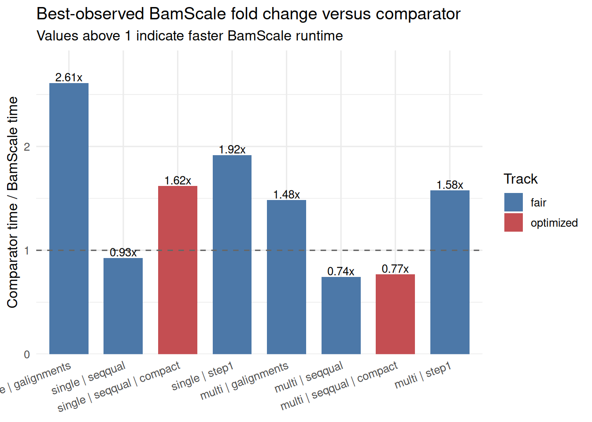
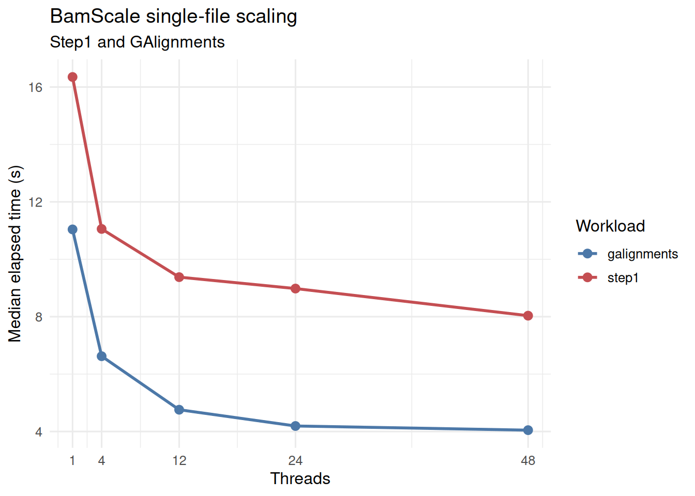
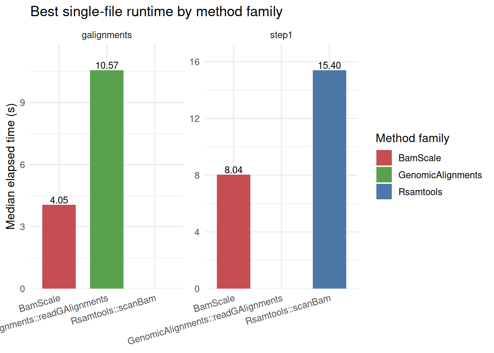
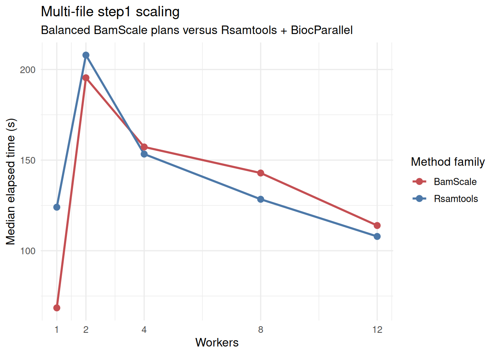
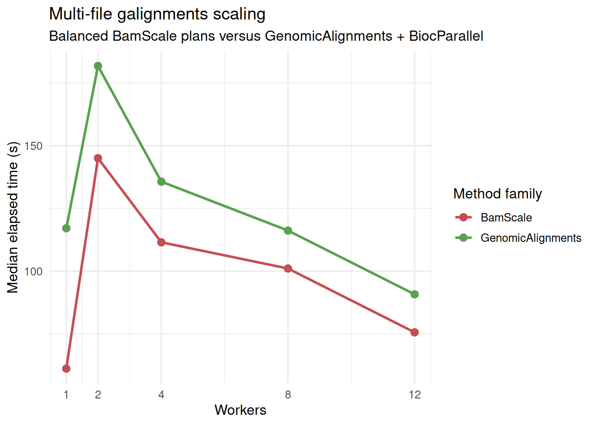
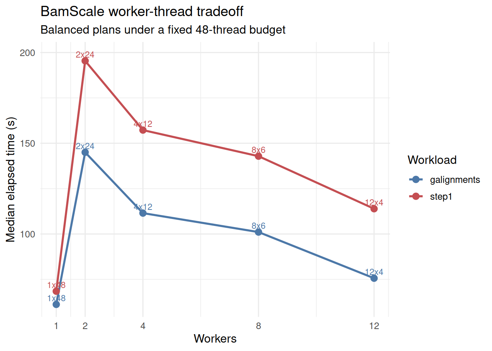
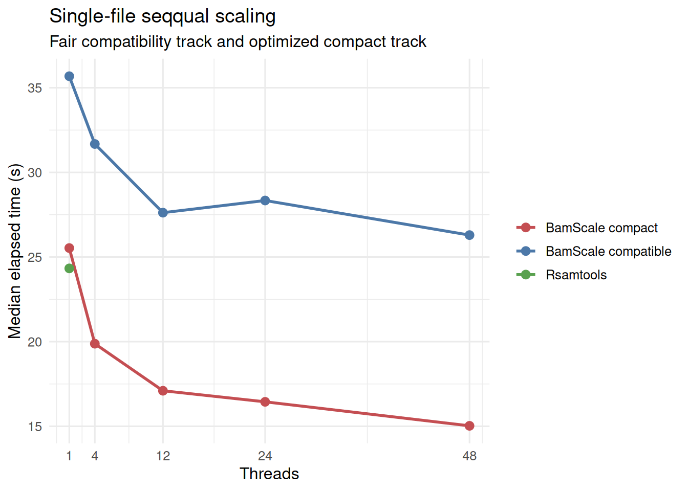
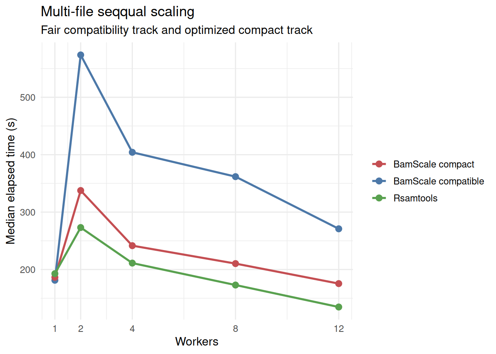

# Benchmarking BamScale Across Step1, GAlignments, and SeqQual Workloads

## 1 Overview

This article combines the final benchmark runs used for the current
BamScale benchmark summary:

- `step1` and `galignments` from run_20260320_133141
- `seqqual` from run_20260320_162359

These runs were generated with the same server-first benchmark harness,
the same balanced profile family, the same deterministic case order, and
the same worker/thread budget policy. `Seqqual` is reported separately
because it includes both the fair compatibility track and the optimized
compact track.

## 2 Data Loading

## 3 Benchmark Provenance

- Step1 and GAlignments run: run_20260320_133141
- SeqQual run: run_20260320_162359
- Step1/GAlignments results directory:
  /home/runner/work/BamScale/BamScale/inst/benchmarks/run_20260320_133141
- SeqQual results directory:
  /home/runner/work/BamScale/BamScale/inst/benchmarks/run_20260320_162359

| Run                 | Workloads          | Profile  | CPU                                      | Logical cores | RAM (GB) | Successful cases |
|:--------------------|:-------------------|:---------|:-----------------------------------------|--------------:|---------:|-----------------:|
| run_20260320_133141 | step1, galignments | balanced | Intel(R) Xeon(R) Gold 6252 CPU @ 2.10GHz |            96 |    723.6 |               32 |
| run_20260320_162359 | seqqual            | balanced | Intel(R) Xeon(R) Gold 6252 CPU @ 2.10GHz |            96 |    723.6 |               26 |

## 4 Methods Rationale

This benchmark suite covers three distinct access patterns:

- `step1`: alignment-metadata extraction without sequence/quality
  materialization. This is a good proxy for BAM filtering,
  fragment-length profiling, and fragment-distribution QC.
- `galignments`: construction of alignment objects suitable for
  Bioconductor workflows centered on `GenomicAlignments`.
- `seqqual`: full sequence and quality extraction. This is reported in
  two BamScale modes:
  - `fair` compatibility mode, which is the closest comparator to
    [`Rsamtools::scanBam`](https://rdrr.io/pkg/Rsamtools/man/scanBam.html)
  - `optimized` compact mode, which reduces internal overhead and should
    be interpreted as an optimized BamScale track rather than a strict
    apples-to-apples replacement for the compatibility path

Across all runs, the benchmark design emphasizes:

- deterministic case order
- balanced BamScale worker/thread plans
- explicit comparator baselines
- single-file and multi-file reporting
- fixed 48-thread budget for multi-file plans

## 5 Input Files

The same underlying four selected BAMs were used for both runs, with
repeated files allowed to populate the 12-file multi-file benchmark set.

| file                                                     | source        | selected_for_single | selected_for_multi | size_mb | has_index |
|:---------------------------------------------------------|:--------------|:--------------------|:-------------------|--------:|:----------|
| /home/chiragp/.cache/R/ExperimentHub/134ab745547e62_2073 | chipseqDBData | TRUE                | TRUE               |   548.3 | TRUE      |
| /home/chiragp/.cache/R/ExperimentHub/134ab7270c5da5_2072 | chipseqDBData | FALSE               | TRUE               |   320.4 | TRUE      |
| /home/chiragp/.cache/R/ExperimentHub/134ab721bfa655_2071 | chipseqDBData | FALSE               | TRUE               |   305.2 | TRUE      |
| /home/chiragp/.cache/R/ExperimentHub/134ab7231ef47d_2074 | chipseqDBData | FALSE               | TRUE               |   227.3 | TRUE      |

## 6 Reference Counts

| run                 | scenario | workload    | n_files | n_records | total_mb |
|:--------------------|:---------|:------------|--------:|----------:|---------:|
| run_20260320_133141 | multi    | galignments |      12 |  77543925 |   4203.4 |
| run_20260320_133141 | multi    | step1       |      12 | 132482148 |   4203.4 |
| run_20260320_133141 | single   | galignments |       1 |   4670364 |    548.3 |
| run_20260320_133141 | single   | step1       |       1 |  16675372 |    548.3 |
| run_20260320_162359 | multi    | seqqual     |      12 | 132482148 |   4203.4 |
| run_20260320_162359 | single   | seqqual     |       1 |  16675372 |    548.3 |

## 7 Best-Observed Summary

| Scenario | Workload    | Track     | Method family     | Method                                            | Plan | Median time (s) |
|:---------|:------------|:----------|:------------------|:--------------------------------------------------|:-----|----------------:|
| multi    | galignments | fair      | BamScale          | BamScale (balanced budget)                        | 1x48 |          61.204 |
| multi    | galignments | fair      | GenomicAlignments | GenomicAlignments::readGAlignments + BiocParallel | 12x1 |          90.777 |
| multi    | seqqual     | fair      | BamScale          | BamScale (balanced budget)                        | 1x48 |         181.277 |
| multi    | seqqual     | fair      | Rsamtools         | Rsamtools::scanBam + BiocParallel                 | 12x1 |         134.667 |
| multi    | seqqual     | optimized | BamScale          | BamScale (compact seqqual budget)                 | 12x4 |         175.451 |
| multi    | step1       | fair      | BamScale          | BamScale (balanced budget)                        | 1x48 |          68.469 |
| multi    | step1       | fair      | Rsamtools         | Rsamtools::scanBam + BiocParallel                 | 12x1 |         107.882 |
| single   | galignments | fair      | BamScale          | BamScale                                          | 1x48 |           4.047 |
| single   | galignments | fair      | GenomicAlignments | GenomicAlignments::readGAlignments                | 1x1  |          10.568 |
| single   | seqqual     | fair      | BamScale          | BamScale                                          | 1x48 |          26.295 |
| single   | seqqual     | fair      | Rsamtools         | Rsamtools::scanBam                                | 1x1  |          24.327 |
| single   | seqqual     | optimized | BamScale          | BamScale (compact seqqual)                        | 1x48 |          15.026 |
| single   | step1       | fair      | BamScale          | BamScale                                          | 1x48 |           8.035 |
| single   | step1       | fair      | Rsamtools         | Rsamtools::scanBam                                | 1x1  |          15.403 |

## 8 BamScale-versus-Comparator Fold Change

| Scenario | Workload    | Track     | BamScale method                   | BamScale plan | BamScale (s) | Comparator method                                 | Comparator plan | Comparator (s) | Comparator / BamScale | BamScale faster (%) |
|:---------|:------------|:----------|:----------------------------------|:--------------|-------------:|:--------------------------------------------------|:----------------|---------------:|----------------------:|--------------------:|
| single   | galignments | fair      | BamScale                          | 1x48          |        4.047 | GenomicAlignments::readGAlignments                | 1x1             |         10.568 |                 2.611 |                61.7 |
| single   | seqqual     | fair      | BamScale                          | 1x48          |       26.295 | Rsamtools::scanBam                                | 1x1             |         24.327 |                 0.925 |                -8.1 |
| single   | seqqual     | optimized | BamScale (compact seqqual)        | 1x48          |       15.026 | Rsamtools::scanBam                                | 1x1             |         24.327 |                 1.619 |                38.2 |
| single   | step1       | fair      | BamScale                          | 1x48          |        8.035 | Rsamtools::scanBam                                | 1x1             |         15.403 |                 1.917 |                47.8 |
| multi    | galignments | fair      | BamScale (balanced budget)        | 1x48          |       61.204 | GenomicAlignments::readGAlignments + BiocParallel | 12x1            |         90.777 |                 1.483 |                32.6 |
| multi    | seqqual     | fair      | BamScale (balanced budget)        | 1x48          |      181.277 | Rsamtools::scanBam + BiocParallel                 | 12x1            |        134.667 |                 0.743 |               -34.6 |
| multi    | seqqual     | optimized | BamScale (compact seqqual budget) | 12x4          |      175.451 | Rsamtools::scanBam + BiocParallel                 | 12x1            |        134.667 |                 0.768 |               -30.3 |
| multi    | step1       | fair      | BamScale (balanced budget)        | 1x48          |       68.469 | Rsamtools::scanBam + BiocParallel                 | 12x1            |        107.882 |                 1.576 |                36.5 |

## 9 Step1 and GAlignments: Single-File Scaling

## 10 Step1: Multi-File Scaling

## 11 GAlignments: Multi-File Scaling

## 12 BamScale Worker-Thread Tradeoff

## 13 SeqQual: Single-File Fair and Compact Tracks

## 14 SeqQual: Multi-File Fair and Compact Tracks

## 15 SeqQual Compact Gain

| Scenario | Plan | Compatible (s) | Compact (s) | Compatible / compact |
|:---------|:-----|---------------:|------------:|---------------------:|
| single   | 1x1  |         35.683 |      25.530 |                1.398 |
| single   | 1x12 |         27.620 |      17.098 |                1.615 |
| single   | 1x24 |         28.339 |      16.444 |                1.723 |
| single   | 1x4  |         31.678 |      19.878 |                1.594 |
| single   | 1x48 |         26.295 |      15.026 |                1.750 |
| multi    | 12x4 |        270.889 |     175.451 |                1.544 |
| multi    | 1x48 |        181.277 |     186.321 |                0.973 |
| multi    | 2x24 |        573.752 |     337.596 |                1.700 |
| multi    | 4x12 |        404.183 |     241.524 |                1.673 |
| multi    | 8x6  |        361.750 |     210.290 |                1.720 |

## 16 Benchmark Interpretation

This combined benchmark supports the following conclusions:

1.  BamScale showed clear single-file and best-case multi-file
    advantages for both `step1` and `galignments`, with the strongest
    multi-file points occurring in the low-worker, high-thread regime.
2.  For `seqqual`, BamScale’s fair compatibility track remained slower
    than the Rsamtools comparator, but the optimized compact track
    substantially reduced that gap and produced a clear single-file win.
3.  In multi-file `seqqual`, the compact track improved on the fair
    compatibility path but did not surpass the best Rsamtools multi-file
    baseline in this run.
4.  Overall, `step1` and `galignments` are the clearest BamScale
    strengths, while `seqqual` compact mode represents a substantial
    optimization that improves, but does not fully close, the multi-file
    gap to the comparator.
