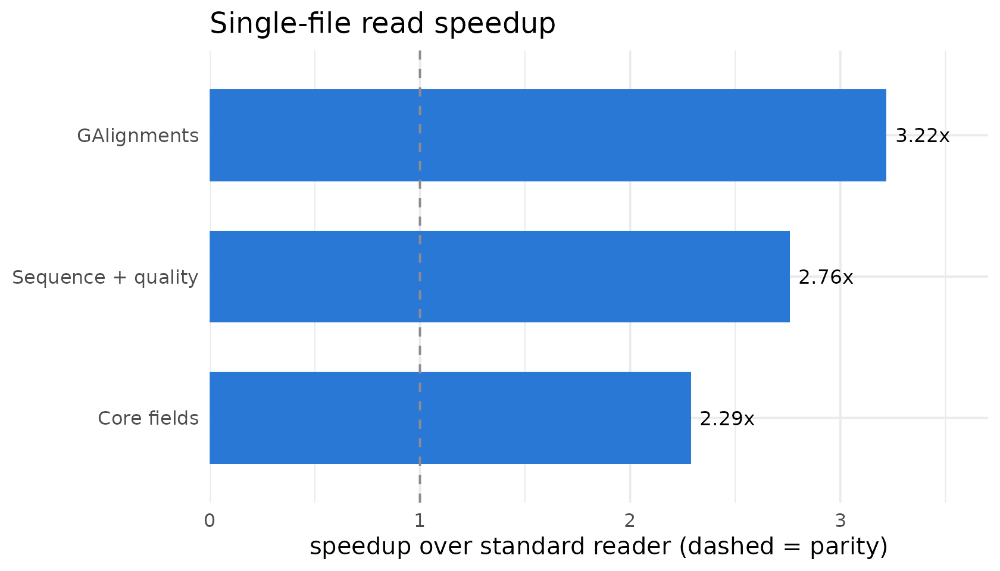
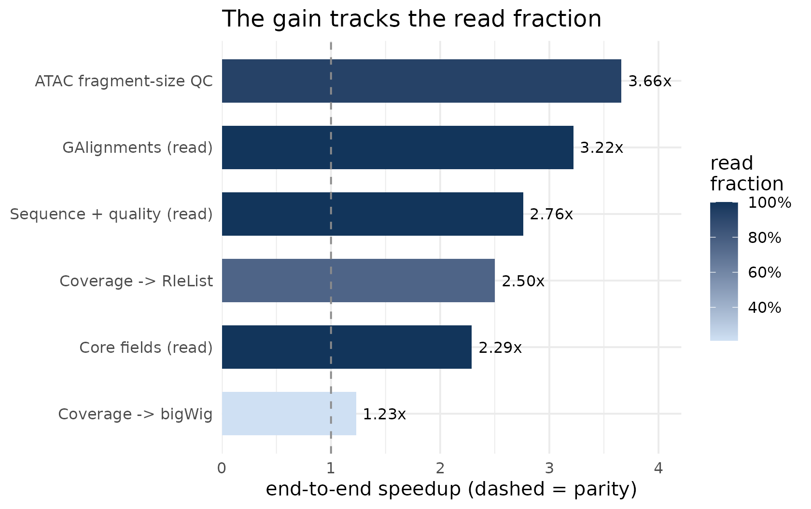

# Benchmarking BamScale: reader throughput and end-to-end workflow impact

## Overview

`BamScale` is a multithreaded BAM reader, built on the `ompBAM` OpenMP
engine, that returns the same native Bioconductor objects as the
standard readers and is a drop-in replacement for
[`Rsamtools::scanBam`](https://rdrr.io/pkg/Rsamtools/man/scanBam.html)
and
[`GenomicAlignments::readGAlignments`](https://rdrr.io/pkg/GenomicAlignments/man/readGAlignments.html).

Reading a BAM is only one step of an analysis, so a faster reader speeds
a workflow end-to-end **only in proportion to the time that workflow
spends reading** (Amdahl’s law). This vignette summarises benchmarks
that quantify *both* the raw read speedup and its end-to-end effect on
two standard workflows — coverage/bigWig track generation and ATAC-seq
fragment-size QC — with BamScale output verified **byte-identical** to
the standard tools.

The numbers below are a concise summary of a representative benchmark
run (Intel Xeon Gold 6252, 96 cores; warm page cache; median of 5
iterations). The benchmark harness that produces them is in
`inst/benchmarks/` (`run_server_benchmark.R`,
`run_workflow_benchmark.R`); see the last section to reproduce the full
results.

## Read throughput on a single large BAM

On a single large BAM, BamScale reads **2.3–3.2x faster** than the
standard reader across three representative access patterns, because it
spreads the BGZF decode across cores:

| Workload | Reads | Standard (s) | BamScale (s) | Threads | Speedup |
|:---|:---|---:|---:|---:|:---|
| Core fields | qname/flag/rname/pos/mapq/cigar | 15.6 | 6.8 | 48 | 2.29x |
| GAlignments | -\> GAlignments object | 10.9 | 3.4 | 48 | 3.22x |
| Sequence + quality | seq + base quality | 22.3 | 8.1 | 24 | 2.76x |

Single-file read throughput: best BamScale configuration vs the
single-threaded standard reader (median of 5 iterations). {.table}



Two honest points. At **one thread** BamScale is at or near the
single-threaded readers (the win comes from threading, not a faster
single-core path), and the scaling is **strongly sublinear** – roughly
2–3x on 48 threads, saturating by about 24 threads. The value is not
near-linear scaling but the ability to use cores that a single-threaded
reader cannot use at all – as on one large BAM in an interactive
session. Object-free command-line decoders such as `samtools` reach
several-fold higher *raw* throughput, but return no Bioconductor object;
BamScale’s role is fast, object-faithful decoding *inside* R.

## End-to-end impact tracks the read fraction

Embedding BamScale as the read step of a complete workflow, the
end-to-end speedup follows how read-dominated that workflow is (Amdahl’s
law):

| Endpoint                  | Layer    | Read fraction | Speedup |
|:--------------------------|:---------|:--------------|:--------|
| ATAC fragment-size QC     | workflow | 93%           | 3.66x   |
| GAlignments (read)        | read     | 100%          | 3.22x   |
| Sequence + quality (read) | read     | 100%          | 2.76x   |
| Coverage -\> RleList      | workflow | 76%           | 2.50x   |
| Core fields (read)        | read     | 100%          | 2.29x   |
| Coverage -\> bigWig       | workflow | 21%           | 1.23x   |

End-to-end speedup by workload endpoint. Read-pattern rows are
single-file read throughput; workflow rows are end-to-end. Read fraction
is the share of the standard pipeline spent reading. {.table}



- **ATAC fragment-size QC** is nearly pure read, so BamScale’s read
  speedup carries through almost intact: **3.66x** end-to-end.
- **Coverage -\> bigWig** is dominated by the shared, single-threaded
  bigWig writer (identical work on both arms), so the end-to-end gain is
  bounded at **1.23x** even though the read phase itself is much faster.
  Stopping at the in-memory coverage `RleList` – what many analyses
  consume next – recovers a **2.50x** gain.

## A note on cores and fairness

A multithreaded reader can occupy cores a single-threaded one cannot. At
**matched core counts** (both arms given the same number of cores) the
two readers are approximately at parity for multi-file processing
(coverage ~1.10x, ATAC ~0.96x): the single-threaded reader already
saturates a machine by parallelising *across* files, so BamScale’s
multi-file advantage comes specifically from also threading *within* a
file – which pays off when there are fewer files than cores.

## Output is identical to the standard tools

Every speedup above is against output verified equal to the standard
tool. The coverage `RleList` is
[`identical()`](https://rdrr.io/r/base/identical.html) to
[`GenomicAlignments::coverage()`](https://rdrr.io/pkg/IRanges/man/coverage-methods.html)
on `readGAlignments` output at every thread count, and the ATAC
fragment-size table is
[`identical()`](https://rdrr.io/r/base/identical.html) to
[`Rsamtools::scanBam`](https://rdrr.io/pkg/Rsamtools/man/scanBam.html)
and byte-identical (maximum absolute difference 0) to
`ATACseqQC::fragSizeDist` over 49.8 million reads. This is what makes
BamScale a genuine drop-in rather than an approximation.

## Try it

``` r

library(BamScale)
bam <- ompBAM::example_BAM("Unsorted")

## Alignment fields as a GAlignments object (drop-in for readGAlignments)
ga <- bam_read(bam, what = c("rname", "pos", "cigar", "strand"),
               as = "GAlignments", threads = 2)
ga
```

    ## GAlignments object with 10000 alignments and 0 metadata columns:
    ##           seqnames strand              cigar    qwidth     start       end
    ##              <Rle>  <Rle>        <character> <integer> <integer> <integer>
    ##       [1]       19      +      1S88M6798N61M       150    572614    579560
    ##       [2]       19      -           1S148M1S       150    579499    579646
    ##       [3]        6      +           60S86M4S       150  44252112  44252197
    ##       [4]        6      -           1S146M3S       150  44252124  44252269
    ##       [5]       12      +             1S149M       150  46185884  46186032
    ##       ...      ...    ...                ...       ...       ...       ...
    ##    [9996]        2      -         16S122M12S       150 186680457 186680578
    ##    [9997]       15      +           4S143M3S       150  90501177  90501319
    ##    [9998]       15      -        26M2I56M66S       150  90501301  90501382
    ##    [9999]        4      + 3M336N95M752N51M1S       150 121801488 121802724
    ##   [10000]        4      -      1S117M121N32M       150 121802677 121802946
    ##               width     njunc
    ##           <integer> <integer>
    ##       [1]      6947         1
    ##       [2]       148         0
    ##       [3]        86         0
    ##       [4]       146         0
    ##       [5]       149         0
    ##       ...       ...       ...
    ##    [9996]       122         0
    ##    [9997]       143         0
    ##    [9998]        82         0
    ##    [9999]      1237         2
    ##   [10000]       270         1
    ##   -------
    ##   seqinfo: 25 sequences from an unspecified genome

``` r

## ...or core fields as a data.frame; `threads` controls within-file parallelism
df <- bam_read(bam, what = c("qname", "flag", "mapq"),
               as = "data.frame", threads = 2)
head(df)
```

    ##                                       qname flag mapq
    ## 1  ST-E00600:137:H77Y3CCXY:1:1101:6837:1309  163  255
    ## 2  ST-E00600:137:H77Y3CCXY:1:1101:6837:1309   83  255
    ## 3 ST-E00600:137:H77Y3CCXY:1:1101:10450:1309  163  255
    ## 4 ST-E00600:137:H77Y3CCXY:1:1101:10450:1309   83  255
    ## 5 ST-E00600:137:H77Y3CCXY:1:1101:15077:1309   99  255
    ## 6 ST-E00600:137:H77Y3CCXY:1:1101:15077:1309  147  255

## Reproducing the full benchmarks

The complete benchmark harness ships under `inst/benchmarks/`:

``` r

dir(system.file("benchmarks", package = "BamScale"))
# run_server_benchmark.R      : read-pattern micro-benchmarks (step1 / GAlignments / seq+qual)
# run_workflow_benchmark.R    : end-to-end coverage and ATAC fragment-size QC workflows
# download_atac_data.R        : fetch + index the ENCODE GM12878 ATAC BAMs used here
```

Each writes machine-readable result tables (`summary.csv`) plus host and
correctness metadata, from which the summary figures above are derived.

## Session information

    ## R version 4.6.1 (2026-06-24)
    ## Platform: x86_64-pc-linux-gnu
    ## Running under: Ubuntu 24.04.4 LTS
    ## 
    ## Matrix products: default
    ## BLAS:   /usr/lib/x86_64-linux-gnu/openblas-pthread/libblas.so.3 
    ## LAPACK: /usr/lib/x86_64-linux-gnu/openblas-pthread/libopenblasp-r0.3.26.so;  LAPACK version 3.12.0
    ## 
    ## locale:
    ##  [1] LC_CTYPE=C.UTF-8       LC_NUMERIC=C           LC_TIME=C.UTF-8       
    ##  [4] LC_COLLATE=C.UTF-8     LC_MONETARY=C.UTF-8    LC_MESSAGES=C.UTF-8   
    ##  [7] LC_PAPER=C.UTF-8       LC_NAME=C              LC_ADDRESS=C          
    ## [10] LC_TELEPHONE=C         LC_MEASUREMENT=C.UTF-8 LC_IDENTIFICATION=C   
    ## 
    ## time zone: UTC
    ## tzcode source: system (glibc)
    ## 
    ## attached base packages:
    ## [1] stats     graphics  grDevices utils     datasets  methods   base     
    ## 
    ## other attached packages:
    ## [1] BamScale_0.99.13 ggplot2_4.0.3    BiocStyle_2.40.0
    ## 
    ## loaded via a namespace (and not attached):
    ##  [1] SummarizedExperiment_1.42.0 gtable_0.3.6               
    ##  [3] xfun_0.60                   bslib_0.11.0               
    ##  [5] Biobase_2.72.0              lattice_0.22-9             
    ##  [7] vctrs_0.7.3                 tools_4.6.1                
    ##  [9] bitops_1.0-9                generics_0.1.4             
    ## [11] stats4_4.6.1                parallel_4.6.1             
    ## [13] tibble_3.3.1                pkgconfig_2.0.3            
    ## [15] Matrix_1.7-5                RColorBrewer_1.1-3         
    ## [17] S7_0.2.2                    desc_1.4.3                 
    ## [19] S4Vectors_0.50.1            cigarillo_1.2.1            
    ## [21] lifecycle_1.0.5             compiler_4.6.1             
    ## [23] farver_2.1.2                Rsamtools_2.28.0           
    ## [25] textshaping_1.0.5           Biostrings_2.80.1          
    ## [27] Seqinfo_1.2.0               codetools_0.2-20           
    ## [29] GenomeInfoDb_1.48.0         htmltools_0.5.9            
    ## [31] sass_0.4.10                 yaml_2.3.12                
    ## [33] pillar_1.11.1               pkgdown_2.2.1              
    ## [35] crayon_1.5.3                jquerylib_0.1.4            
    ## [37] BiocParallel_1.46.0         cachem_1.1.0               
    ## [39] DelayedArray_0.38.2         abind_1.4-8                
    ## [41] ompBAM_1.16.0               tidyselect_1.2.1           
    ## [43] digest_0.6.39               dplyr_1.2.1                
    ## [45] bookdown_0.47               labeling_0.4.3             
    ## [47] fastmap_1.2.0               grid_4.6.1                 
    ## [49] cli_3.6.6                   SparseArray_1.12.2         
    ## [51] magrittr_2.0.5              S4Arrays_1.12.0            
    ## [53] withr_3.0.3                 UCSC.utils_1.8.0           
    ## [55] scales_1.4.0                httr_1.4.8                 
    ## [57] rmarkdown_2.31              XVector_0.52.0             
    ## [59] matrixStats_1.5.0           otel_0.2.0                 
    ## [61] ragg_1.5.2                  evaluate_1.0.5             
    ## [63] knitr_1.51                  GenomicRanges_1.64.0       
    ## [65] IRanges_2.46.0              rlang_1.3.0                
    ## [67] Rcpp_1.1.2                  glue_1.8.1                 
    ## [69] BiocManager_1.30.27         BiocGenerics_0.58.1        
    ## [71] jsonlite_2.0.0              R6_2.6.1                   
    ## [73] MatrixGenerics_1.24.0       GenomicAlignments_1.48.0   
    ## [75] systemfonts_1.3.2           fs_2.1.0
